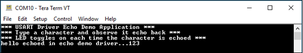

# Title

This example application demonstrates the synchronous mode of the USART driver by echoing the received characters

## Description

This example uses the synchronous mode of the USART driver to communicate over UART console. It receives and echoes back the characters entered by the user.

## Downloading and building the application

To clone or download this application from Github, go to the [main page of this repository](https://github.com/Microchip-MPLAB-Harmony/core_apps_sam_ha1) and then click Clone button to clone this repository or download as zip file.
This content can also be downloaded using content manager by following these [instructions](https://github.com/Microchip-MPLAB-Harmony/contentmanager/wiki).

Path of the application within the repository is **apps/driver/usart/sync/usart_echo/firmware** .

To build the application, refer to the following table and open the project using its IDE.

| Project Name      | Description                                    |
| ----------------- | ---------------------------------------------- |
| sam_ha1_xpro_freertos.X | MPLABX project for [SAM HA1G16A Xplained Pro Evaluation Kit](https://www.microchip.com/DevelopmentTools/ProductDetails/PartNO/ATSAMHA1G16A-XPRO) |
|||

## Setting up the hardware

The following table shows the target hardware for the application projects.

| Project Name| Board|
|:---------|:---------:|
| sam_ha1_xpro_freertos.X | [SAM HA1G16A Xplained Pro Evaluation Kit](https://www.microchip.com/DevelopmentTools/ProductDetails/PartNO/ATSAMHA1G16A-XPRO) |
|||

### Setting up [SAM HA1G16A Xplained Pro Evaluation Kit](https://www.microchip.com/DevelopmentTools/ProductDetails/PartNO/ATSAMHA1G16A-XPRO)

- Connect the Debug USB port on the board to the computer using a micro USB cable

*Note: ATSAMHA1G16A device in SAM HA1G16A Xplained Pro board is not recommended for new design, hence replace the device with ATSAMHA1G16AB device. Connect the supported external debugger to Cortex Debug Port*

## Running the Application

1. Open the Terminal application (Ex.:Tera Term) on the computer.
2. Configure the serial port settings as follows:
    Baud : 115200

    Data : 8 Bits
    
    Parity : None
    
    Stop : 1 Bit
    
    Flow Control : None
3. Build and program the application using its IDE.
4. Type a character and observe the output on the console as shown below:
    - On success, the character typed is echoed back and an LED toggles each time a character is echoed.

    	

Refer to the following table for LED name:

| Board | LED Name |
| ----- | -------- |
|  [SAM HA1G16A Xplained Pro Evaluation Kit](https://www.microchip.com/DevelopmentTools/ProductDetails/PartNO/ATSAMHA1G16A-XPRO) | LED0 |
|||